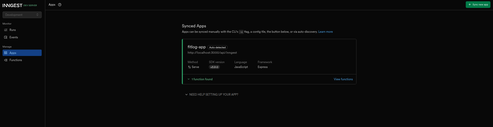
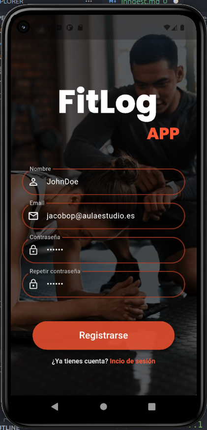
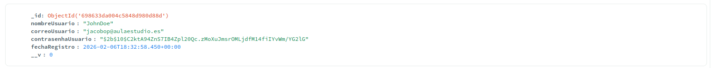
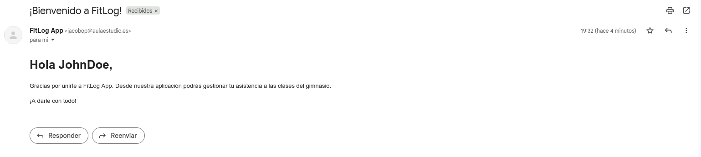

# Implementación de inngest a FitLog App:

Para la implementación de inngest, he decido implementarlo en esta tarea, por sera la que estoy desarrollando actualmente y porque me parece que tiene sentido aplicarlo para, por ejemplo, el registro de usuarios, recordatorios de actividades y etc.

## Proceso de implementación de inngest:

### Instalación de paquetes:

Como además de usar inngest, mi backend se basa en Express y voy a necesitar enviar emails, voy a instalar también los paquetes de nodemailer y concurrently (Para no tener que iniciar por separado los servicios de express e inngest):


`npm install inngest nodemailer concurrently`

### Creación de los eventos:

He creado un archivo centralizado para configurar el cliente de Inngest y definir las funciones que reaccionan a los eventos:

```
import { Inngest } from "inngest";
import nodemailer from "nodemailer";

// Configuración de Nodemailer
const transporter = nodemailer.createTransport({
  service: "gmail", 
  auth: {
    user: process.env.EMAIL_USER,
    pass: process.env.EMAIL_PASS,
  },
});

// Cliente de inngest
export const inngest = new Inngest({ id: "fitlog-app" });

export const enviarCorreoBienvenida = inngest.createFunction(
  { id: "enviar-bienvenida" },
  { event: "app/usuario.registrado" },
  async ({ event, step }) => {
    const { correoUsuario, nombreUsuario } = event.data;

    await step.run("enviar-email", async () => {
      console.log(`Enviando correo de bienvenida a ${nombreUsuario} (${correoUsuario})...`);
      const mailOptions = {
        from: `"FitLog App" <${process.env.EMAIL_USER}>`,
        to: correoUsuario,
        subject: "¡Bienvenido a FitLog!",
        html: `
          <h1>Hola ${nombreUsuario},</h1>
          <p>Gracias por unirte a FitLog App. Desde nuestra aplicación podrás gestionar tu asistencia a las clases del gimnasio.</p>
          <p>¡A darle con todo!</p>
        `,
      };

      return await transporter.sendMail(mailOptions);
    });
  }
);
```

### Conexión con Express:

Expongo un endpoint para que el Inngest pueda comunicarse con nuestra aplicación y ejecutar las funciones definidas:

`app.use("/api/inngest", serve({ client: inngest, functions: [enviarCorreoBienvenida] }));`

### Evento de registro:

```
// Enviar evento a Inngest
inngest.send({
    name: "app/usuario.registrado",
    data: { nombreUsuario, correoUsuario }
}).catch(err => console.error("Error enviando a Inngest:", err));
```

### Automatización del inicio de los servidores:

```
"scripts": {
  "server": "node src/servidor.js",
  "inngest": "npx inngest-cli@latest dev",
  "dev": "concurrently \"npm run server\" \"npm run inngest\""
}
```

## Imágenes del funcionamiento:

### Imagen del panel de control de inngest:


### Imagen del registro en la App


### Imagen de la cuenta creada


### Imagen del correo recibo al registrarse
